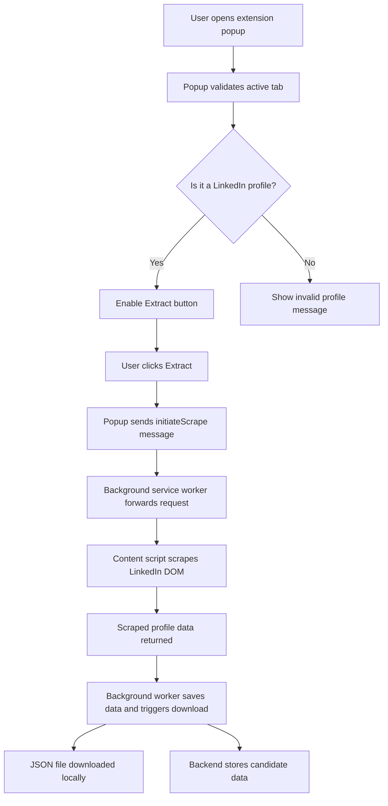
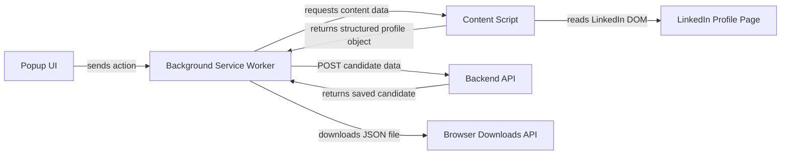

# LinkedIn Profile Scraper Extension

## Project Review

This project is a browser extension designed to scrape structured profile data from a LinkedIn profile page, save the profile locally as a JSON file, and optionally persist the extracted candidate information in a backend database. The solution combines a Chrome/Edge extension frontend with a lightweight backend service to provide both download and storage capabilities.

## 1. High-Level Design (HLD)

### 1.1 Purpose
The extension is intended to:
- detect when the user is viewing a LinkedIn profile page,
- extract relevant profile information from the page DOM,
- package the data into a structured object,
- save the result locally as a JSON file,
- and store the data in a backend database for later retrieval.

### 1.2 Scope
In scope:
- popup-based user interaction,
- content-script-based scraping,
- background service worker message handling,
- local JSON download,
- backend persistence through a REST API.

Out of scope:
- full LinkedIn API integration,
- automated browsing or authentication flows,
- enterprise-grade scraping orchestration.

### 1.3 Goals
- Provide a simple user-friendly extraction experience.
- Capture profile fields such as name, headline, company, location, experience, education, skills, projects, certifications, interests, and profile image.
- Create a reusable architecture that can be extended with more data sources or storage options.

### 1.4 Non-Functional Considerations
- The extension should work within Chrome/Edge browser extension constraints.
- The scraper should be resilient to basic DOM structure changes.
- Data should be stored safely and available for later review.

## 2. Architecture Overview

The system follows a modular event-driven architecture built around the browser extension model and a backend service.

### 2.1 Architectural Layers

1. Frontend Extension Layer
   - Popup UI for user interaction.
   - Content script for extracting data from the LinkedIn page.
   - Background service worker for message routing and download handling.

2. Backend Layer
   - Express server for receiving candidate data.
   - PostgreSQL integration through the Node.js pg package.

3. Storage Layer
   - Local JSON file download.
   - Backend database persistence.

### 2.2 Data Flow Diagram

## 3. Component Breakdown

### 3.1 Popup UI
File responsibility:
- popup.html
- popup.js
- popup.css

Responsibilities:
- checks the currently active tab URL,
- determines whether the tab is a valid LinkedIn profile,
- enables or disables the extract action,
- sends scrape requests to the background layer,
- updates the UI with status and history information.

### 3.2 Content Script
File responsibility:
- content.js

Responsibilities:
- runs only on LinkedIn profile pages,
- reads the page DOM,
- extracts profile sections such as name, headline, location, experience, education, skills, activity, projects, certifications, interests, and profile image,
- returns the structured profile object to the extension runtime.

### 3.3 Background Service Worker
File responsibility:
- background.js

Responsibilities:
- listens for messages from the popup,
- forwards scrape requests to the content script,
- handles data persistence,
- sends the data to the backend API,
- creates a downloadable JSON payload,
- triggers the browser download.

### 3.4 Backend Server
File responsibility:
- Backend/server.js

Responsibilities:
- exposes REST endpoints for storing and retrieving candidates,
- connects to PostgreSQL,
- upserts candidate records by URL,
- returns stored records for UI history display.

### 3.5 Manifest Configuration
File responsibility:
- manifest.json

Responsibilities:
- declares extension permissions,
- enables the content script for LinkedIn profile URLs,
- registers the popup entry point,
- configures the service worker background context.

## 4. Component Interaction Flow

### 4.1 Main User Flow
1. The user opens the extension popup.
2. The popup inspects the active tab.
3. If the tab is a LinkedIn profile, the extract action becomes available.
4. When the user clicks Extract, the popup sends a message to the background worker.
5. The background worker contacts the content script.
6. The content script scrapes the page and returns structured data.
7. The background worker saves the data to the backend and downloads a JSON file.
8. The popup refreshes the stored history view.

### 4.2 Interaction Diagram

## 5. Data Flow

The data flow can be summarized as:
- Popup identifies a valid profile page.
- Content script extracts visible profile information from the DOM.
- Background worker coordinates the scrape and persistence steps.
- The backend stores data in PostgreSQL.
- The browser downloads the same data as a JSON file.